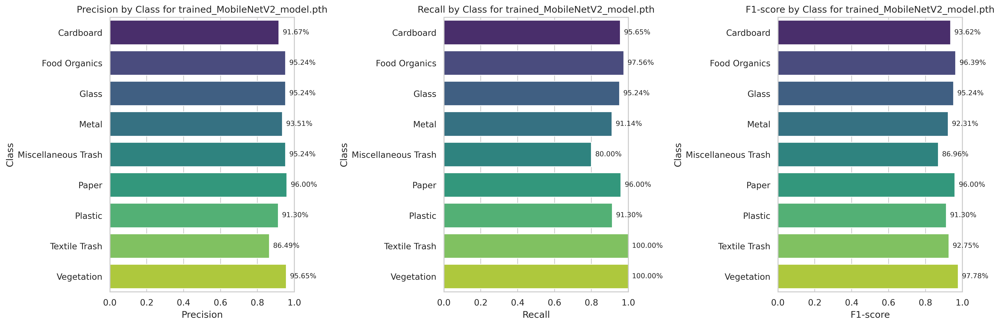

# Deep Learning for Real Waste Image Classification

## Abstract
Improper waste management poses a significant environmental challenge, necessitating innovative solutions for efficient classification and recycling. This study introduces a deep learning approach for the classification of waste images using the Real Waste Dataset[1], a publicly available dataset on Kaggle[2] comprising 4752 images categorized into 9 waste classes. Leveraging pretrained models (ResNet50[3], DenseNet121[4], MobileNetV2[5], VGG-16[6], EfficientNetV2[7], and Swin Transformer[8]) alongside a custom CNN, the proposed pipeline integrates data augmentation, class weighting, and hyperparameter optimization to address class imbalance and enhance model robustness. Among the models tested, MobileNetV2 achieves a remarkable accuracy of 93.28%, making it a highly efficient choice for resource-constrained applications. Despite these successes, challenges persist in the classification of heterogeneous categories like "Miscellaneous Trash," highlighting areas for future improvement to refine accuracy across all waste types.

## Table of Contents
- [Deep Learning for Real Waste Image Classification](#deep-learning-for-real-waste-image-classification)
  - [Abstract](#abstract)
  - [Table of Contents](#table-of-contents)
  - [Project Overview](#project-overview)
  - [Methodology](#methodology)
    - [Custom CNN Architecture](#custom-cnn-architecture)
  - [Results](#results)
    - [Observations from Misclassification Analysis](#observations-from-misclassification-analysis)
  - [Requirements](#requirements)
  - [Contributions](#contributions)
  - [References](#references)
  - [Authors](#authors)

## Project Overview
This project focuses on developing a robust deep learning pipeline for waste classification using the Real Waste Dataset. By leveraging state-of-the-art pretrained models and implementing strategies to address class imbalance, we aim to improve the efficiency and accuracy of waste management systems.

   <h2>Dataset</h2>
   
The Real Waste Dataset[1] contains 4752 labeled images spanning 9 categories:
   
   

      
   

The dataset is available on [Kaggle](https://www.kaggle.com/datasets/joebeachcapital/realwaste). The data was split into training, validation, and test sets, and augmented to boost generalization.

## Methodology
1. **Preprocessing**:
   - Dataset splitting: 80% train, 10% validation from the original 10% train set.
   - Data augmentation (Random): Rotation, vertical/horizontal flipping, zoom.
   - Class balancing using weighted loss functions.

2. **Models Tested**:
   - Pretrained models: ResNet50, DenseNet121, MobileNetV2, VGG-16, EfficientNetV2, Swin Transformer.
   - Custom CNN architecture.

3. **Optimization**:
   - Hyperparameter tuning.
   - Regularization techniques.

4. **Evaluation Metrics**:
   - Accuracy.
   - Confusion matrix.
   - Precision, Recall, F1-Score.

### Custom CNN Architecture
The custom CNN consists of 5 convolutional blocks, each convolutional block contains 2 convolutional layers, after each convolutional layer we applied batch normalization and ReLU activation. Once both convolutional layers in the block have been processed we applied max-pooling for down-sampling. The number of filters doubles with each block, starting from 64 and reaching 512 in the final block.
After the 5 convolutional blocks, a Global Average Pooling layer reduces the spatial dimensions to a single value per feature map,the resulting output is then flattened and passed through a fully connected layer with 512 neurons, followed by a 30% dropout layer for regularization and finally the last fully connected layer maps the 512-dimensional input to an output of size equal to the number of classes for classification.

## Results
- **Best Model**: MobileNetV2
- **Accuracy**: 93.28%
- **Confusion Matrix**: 
   
- **Precision, Recall, F1-Score**: 
   

### Observations from Misclassification Analysis

The analysis of misclassified samples reveals that the model demonstrates a solid understanding of the waste classification problem. It effectively captures the key features of objects across various categories, indicating strong generalization capabilities. However, the model also exhibits certain limitations, which stem from the inherent complexities of waste classification:

1. **Visual Similarities:** 
   - Glass and plastic bottles often appear similar in shape and texture.
   - Paper and cardboard share visual characteristics that can be challenging to distinguish, even for humans.

2. **Mixed-Class Objects:**
   - Items in the "Miscellaneous Trash" category frequently consist of multiple materials (e.g., plastic, metal, and paper), making them prone to misclassification.

3. **Dataset Limitations:** 
   - The accuracy of the model could be further improved with the addition of more diverse and representative training data, particularly for underrepresented or ambiguous categories.

Overall, the model performs admirably, generalizing well and classifying objects effectively across most categories. Addressing these inherent challenges with enriched training data and advanced techniques would likely enhance its predictive performance further.

## Requirements
- Python 3.8 or later
- NumPy
- Pandas
- Matplotlib
- scikit-learn
- PyTorch

## Contributions
Contributions are welcome! Please fork the repository and submit a pull request.

## References
1. Real Waste Dataset: [Kaggle Dataset](http://dx.doi.org/10.3390/info14120633)
2. ResNet50: [Deep Residual Learning for Image Recognition](https://arxiv.org/abs/1512.03385)
3. DenseNet121: [Densely Connected Convolutional Networks](https://arxiv.org/abs/1608.06993)
4. MobileNetV2: [Inverted Residuals and Linear Bottlenecks](https://arxiv.org/abs/1801.04381)
5. VGG-16: [Very Deep Convolutional Networks for Large-Scale Image Recognition](https://arxiv.org/abs/1409.1556)
6. EfficientNetV2: [EfficientNetV2: Smaller Models and Faster Training](https://arxiv.org/abs/2104.00298)
7. Swin Transformer: [Swin Transformer: Hierarchical Vision Transformer](https://arxiv.org/abs/2103.14030)

---

## Authors
Alessio Lani, Enrico Giordani, Lorenzo Arcioni, Marta Lombardi, Valeria Avino